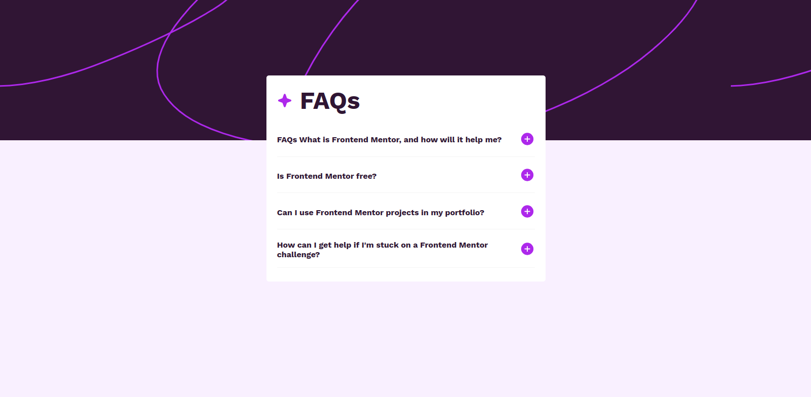
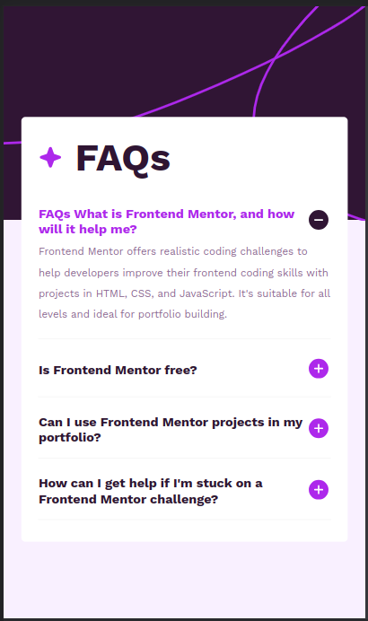

# Frontend Mentor - FAQ accordion solution

This is a solution to the [FAQ accordion challenge on Frontend Mentor](https://www.frontendmentor.io/challenges/faq-accordion-wyfFdeBwBz). Frontend Mentor challenges help you improve your coding skills by building realistic projects. 

## Table of contents

- [Overview](#overview)
  - [The challenge](#the-challenge)
  - [Screenshot](#screenshot)
  - [Links](#links)
- [My process](#my-process)
  - [Built with](#built-with)
  - [What I learned](#what-i-learned)
  - [Continued development](#continued-development)
- [Author](#author)


## Overview

### The challenge

Users should be able to:

- Hide/Show the answer to a question when the question is clicked
- Navigate the questions and hide/show answers using keyboard navigation alone
- View the optimal layout for the interface depending on their device's screen size
- See hover and focus states for all interactive elements on the page

### Screenshot

#### Desktop



#### Mobile




### Links

- Solution URL: [Add solution URL here](https://your-solution-url.com)
- Live Site URL: [Add live site URL here](https://your-live-site-url.com)

## My process

- The first step was to analyse the complexity of the challenge and choose the right optimal strategy and tools to solve the problem.
- I implemented the desktop view first and then the mobile one
- I chose to use react because the challenged had question that would benefit from the use of reusable components rather than using plain html and js.

### Built with

- Semantic HTML5 markup
- Flexbox
- [React](https://reactjs.org/) - JS library

### What I learned

- The power of reusable components.
- You can change the color of svgs using css


```js

export const Question = ({ question, answer }) => {

    const [isCollapsed, setIsCollapsed] = useState(true);

    const toggleAnswer = () => {
        setIsCollapsed(!isCollapsed);
    }

    return (

        <article className="question">


            <div className="question__heading">

                <p className="question__heading-header" onClick={toggleAnswer}>
                    {question}
                </p>

                <button className="expand-collapse-btn" onClick={toggleAnswer}>
                    
                </button>
            </div>

            {
                !isCollapsed &&
                <p className="answer">
                    {answer}
                </p>
            }


        </article>
    )
}

```


### Continued development

- Responsiveness

## Author

- Website - [Takudzwa L Chimanikire](https://github.com/Taku-chimanaz)
- Frontend Mentor - [@yourusername](https://www.frontendmentor.io/profile/Taku-chimanaz)
- Twitter - [@tk_cypher](https://www.twitter.com/tk_cypher)

